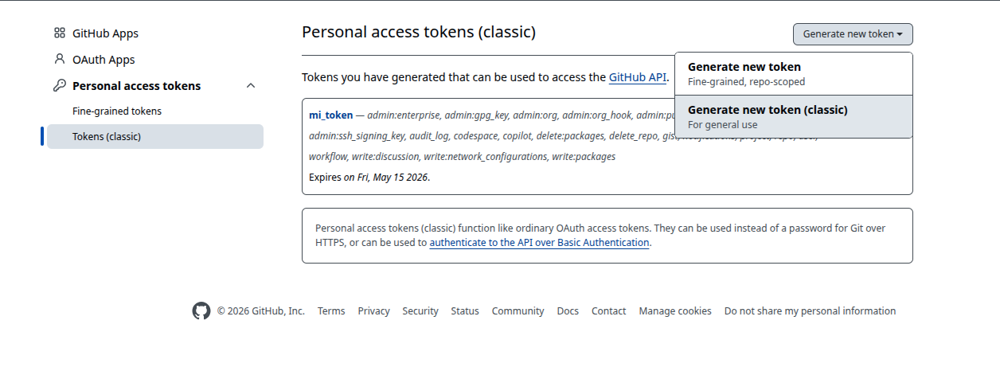
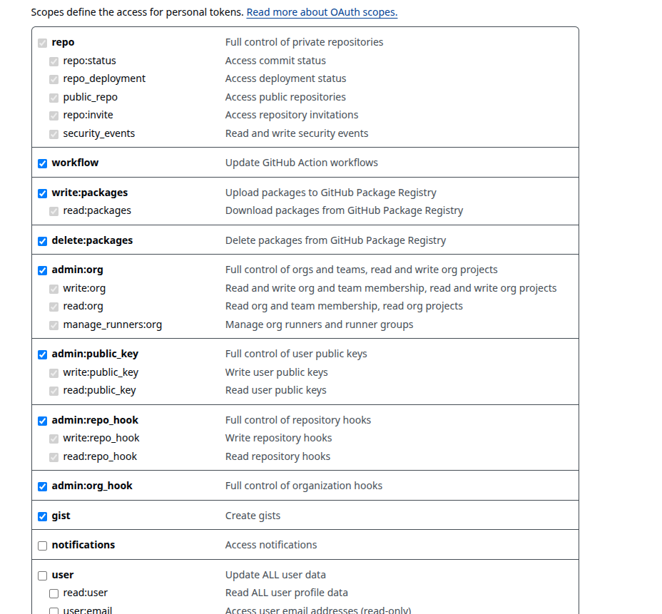

# Proyecto MySQL Oracle

### No es muy dificil de instalar

## Python
### Necesitas python y pip en tu windows. Para saber si estan instalados puedes ejecutar los siguientes comandos en tu terminal:
python --version
pip --version

### Luego tienes que crear un entorno virtual con:
python -m venv .venv

### Luego tienes que activar el entorno virtual con:
source .venv/Scripts/activate

### Luego tienes que instalar los paquetes con:
pip install -r requirements.txt

## MySQL y workbench
### Luego en tu workbench crea la base de datos curso tal que asi:
CREATE DATABASE curso;

### Crea el usuario darwin con la contraseña "$Para2109digma" y con todos los privilegios:
CREATE USER 'darwin'@'%' IDENTIFIED BY '$Para2109digma';
GRANT ALL PRIVILEGES ON curso.* TO 'darwin'@'%';
FLUSH PRIVILEGES;

## Git
### Una vez que compruebes que tienes python y pip instalados, vamos a iniciar la carpeta con git:
git init

### Una vez que hayas iniciado la carpeta con git, vamos a añadir todos los archivos con:
git add .

### Una vez que hayas añadido todos los archivos, vamos a crear un commit con:
git commit -m "Initial commit"

### Una vez que hayas creado el commit, vamos a crear una rama principal:
git branch -M main

### Vas a comprobar que estas en main con:
git branch

### Si no estas en main te cambias con:
git checkout main

### Antes de vincular el remoto vas a crear el token en github:
https://github.com/settings/tokens

### En tokens(classic) le das a generar nuevo token (classic) y le das a generar token(con ctrl y click puedes ver la imagen manteniendo la flecha sobre image.png o sonbre image-1.png)

### Le das todos los permisos:

### Le das a generar token y recuerda guardarlo

### Haz un git status y un git branch para verificar que estas en main

### Una vez que hayas creado la rama principal, vamos a crear un remote con:
git remote add origin https://github.com/darwinjavier25/mysql_queries.git

### Una vez que hayas creado el remote, vamos a hacer un push con:
git push -u origin main

### Finalmente inicias la aplicacion desde consola con:
python web_app.py

### Y ya esta, ahora puedes acceder a la aplicacion en http://localhost:5000

### Luego en la web ve a "Archivo SQL" y adjunta y ejecuta uno por uno y en orden los archivos que estan en la carpeta de examples
0_simple_select.sql
1_setup_test_data.sql
2_sample_queries.sql
3_queries_prueba.sql
4_DQL_consultas.sql
